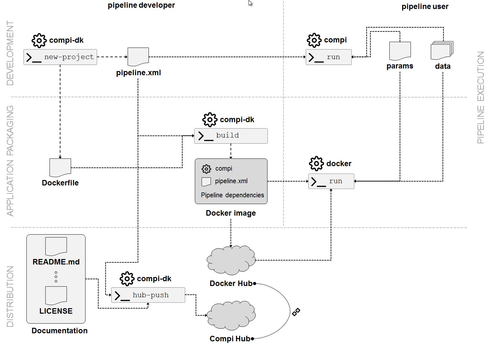
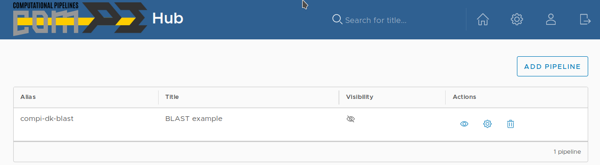
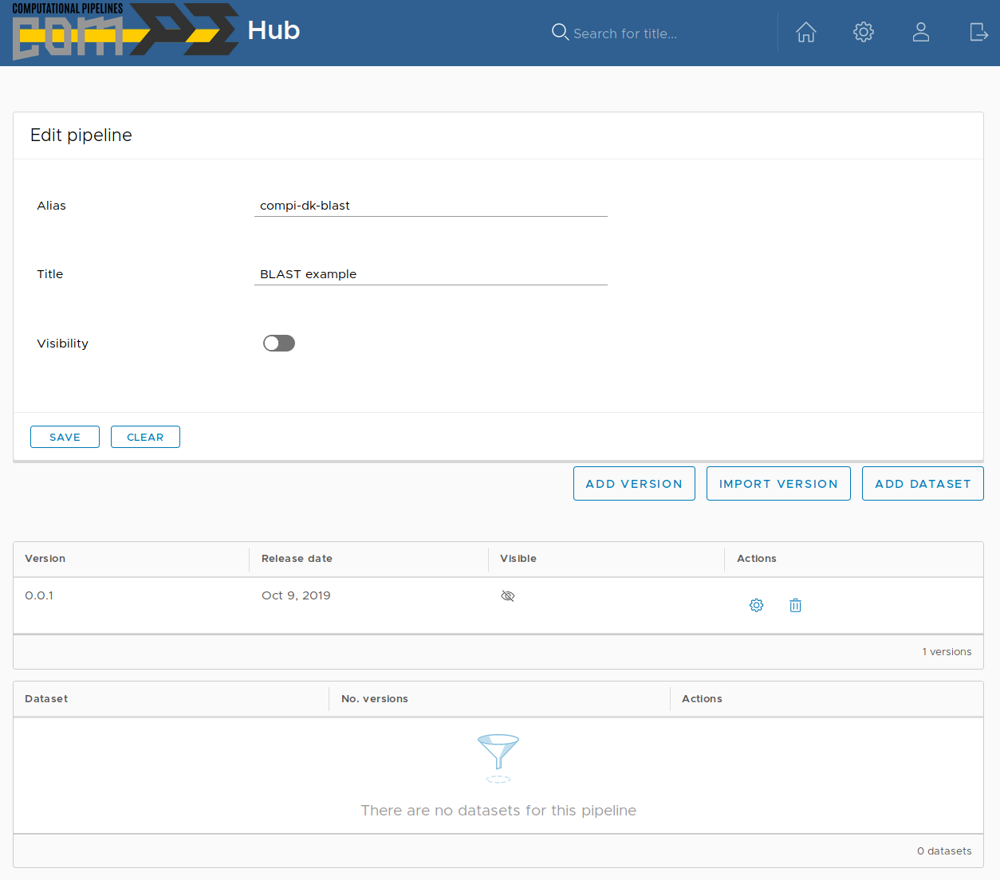
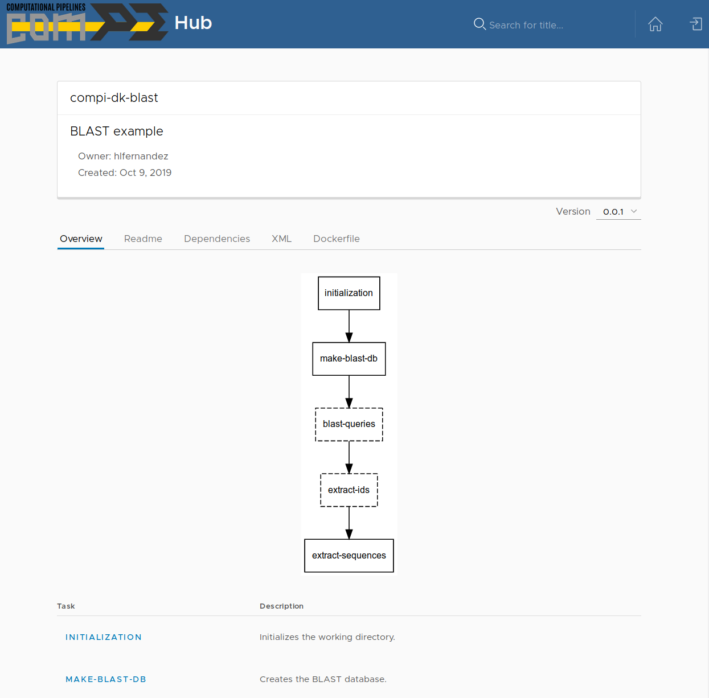

.. _application_development:

Application development
***********************

The following image summarizes the main interactions between the elements of :ref:`compi_ecosystem` in the development of Compi-based applications.

   
This development starts with the creation of new Compi Development Kit project with the ``compi-dk new-project command``. This command mainly initializes a project directory by creating two template files to start with the pipeline development, namely ``pipeline.xml`` and ``Dockerfile``. In addition, it also creates the empty files ``README.md``, ``DEPENDENCIES.md``, and ``LICENSE``, and the folders ``params-examples`` and ``runners-examples`` (this one containing working examples of generic Compi runners).

The pipeline developer can now start the definition of the pipeline by modifying the ``pipeline.xml`` template and test it locally (using the ``compi`` executable) or test it by running the Docker image. For this latter case, when the ``compi-dk build`` command is executed in the project directory, a Docker image for the pipeline is created. This image contains the ``compi`` executable, the ``pipeline.xml`` being developed as well as the pipeline dependencies as defined in the ``Dockerfile``.

Once the development is finished, it is time to distribute the Compi-based application. By one hand, the Docker image containing the final Compi-based application can be directly distributed to the users and/or pushed to Docker Hub. On the other hand, the pipeline can be registered at Compi Hub either using the web interface (https://www.sing-group.org/compihub) or using the ``compi-dk hub-push`` command. Compi Hub stores pipelines and one or more versions for each pipeline, where each version is associated to one ``pipeline.xml`` file.

A practical example
===================

This section shows a practical example of developing a Compi-based application using all the ecosystem components shown before.

This simple BLAST pipeline receives two inputs: one FASTA file to use as reference genome for creating a BLAST database and one or more FASTA files containing only one sequence. With these inputs, the pipeline:

1. Creates a BLAST database.
2. Performs a BLAST query of each sequence file against the database.
3. Retrieves the `n` top hits from each query.
4. Extracts the sequences from the DB corresponding to these top hits.
5. Merges all the sequences into a single FASTA file, which is the main pipeline output.

1. Creating the compi-dk project
--------------------------------

The first step is the creation of a new compi-dk project. To do so, go to a directory where the project directory will be created and run:

.. code-block:: bash

 compi-dk new-project -n test/compi-dk-blast -p compi-dk-blast -i ubuntu:18.04

Where:

- `test/compi-dk-blast` is the name of the Docker image for the Compi-based application.
- `compi-dk-blast` is the name of the project directory.
- `ubuntu:18.04` is the base image for the Dockerfile.

2. Adding the pipeline dependencies
-----------------------------------

The second step is the edition of the Dockerfile in order to add the dependencies of the pipeline. In this case the pipeline only requires BLAST, thus adding the following line to the Dockerfile is enough:

.. code-block:: none

 RUN apt-get update && apt-get install -y ncbi-blast+=2.6.0-1

The entire Dockerfile will now look like the following:

.. code-block:: none

    FROM ubuntu:18.04
    LABEL maintainer="hlfernandez"

    # INSTALL COMPI
    ADD image-files/compi.tar.gz /

    # PLACE HERE YOUR DEPENDENCIES (SOFTWARE NEEDED BY YOUR PIPELINE)

    RUN apt-get update && apt-get install -y ncbi-blast+=2.6.0-1

    # ADD PIPELINE
    ADD pipeline.xml /pipeline.xml
    ENTRYPOINT ["/compi", "run",  "-p", "/pipeline.xml"]

3. Developing the pipeline
--------------------------

Now, it is time to edit the ``pipeline.xml`` template created in the project directory in order to add the pipeline tasks. Let's start adding the first two tasks and testing the pipeline.

.. code-block:: xml

    <?xml version="1.0" encoding="UTF-8"?>

    <pipeline xmlns="http://www.sing-group.org/compi/pipeline-1.0"
        xmlns:xsi="http://www.w3.org/2001/XMLSchema-instance">
        <version>0.0.1</version>

        <params>
            <param name="dataDir" shortName="dd">The directory containing the input data files.</param>
            <param name="dbFasta" shortName="dbf">The name of the FASTA file to build the BLAST DB (under dataDir).</param>
            <param name="workingDir" shortName="wd" global="true">The directory to put the pipeline results.</param>
            <param name="dbDir" shortName="dbd" global="true" defaultValue="blastDB">The name of the directory to put the BLAT DB (under workingDir).</param>
        </params>
        <tasks>
            <task id="initialization">
                mkdir -p ${workingDir}/${dbDir}
            </task>
            <task id="make-blast-db" after="initialization" params="dataDir dbFasta">
                makeblastdb -in ${dataDir}/${dbFasta} -dbtype prot -parse_seqids -out ${workingDir}/${dbDir}/${dbFasta}
            </task>
        </tasks>
    </pipeline>

The Docker image is built using the ``compi-dk build`` command, which validates the XML file before building the Docker image. Also, the first execution of the command will download the Compi installer to add to the Docker image (in the ``image-files`` directory). 

Once the image is ready, it can be tested by running it with the apropriate pipeline parameters. The test data is available here (http://static.sing-group.org/software/compi/downloads/manual/blast-example/data.zip). Download and uncompress this file and create a file named ``compi.parameters`` with the following contents (note that ``dataDir`` is the directory where the test data was uncompressed):

.. code-block:: none

    dataDir=/path/to/manual-blast-example/
    dbFasta=GCF_000001405.39_GRCh38.p13_protein.faa
    workingDir=/tmp/blast-example

The following command will run the ``compi`` command passing the parameters file as parameter:

.. code-block:: none

    docker run --rm -v ${dataDir}:${dataDir} -v ${workingDir}:${workingDir} test/compi-dk-blast -pa ${dataDir}/compi.parameters

Once the execution has finished, the directory ``/tmp/blast-example/blastDB`` will contain the BLAST database files.

When this cycle of ``pipeline.xml`` edition, image re-building and testing is completed, the final Comi-based application is ready to be distributed. The following ZIP file (http://static.sing-group.org/software/compi/downloads/manual/blast-example/compi-dk-blast.zip) contains the final ``pipeline.xml`` file, the ``compi.parameters`` and other files for the following section.

The final version of the ``pipeline.xml`` also contains a ``<metadata>`` section that includes task descriptions. These descriptions are used by Compi Hub to show an overview of the pipeline as the following section explains.

4. Distributing the application
-------------------------------

By one hand, the Docker image containing the final Compi-based application can be directly distributed to the users and/or pushed to Docker Hub. On the other hand, the pipeline can be registered at Compi Hub either using the web interface (https://www.sing-group.org/compihub) or using the ``compi-dk hub-push`` command. This section shows how to submit it to Compi Hub using the command line interface of ``compi-dk``. To run the following steps it is required a Compi Hub account.

The first command that must be executed is ``compi-dk hub-init``. which registers the pipeline at Compi Hub. This is equivalent to go to the user pipelines section and using the *Add pipeline* option. The ``hub-init`` init command requires a title and an alias (i.e. a unique identifier) of the pipeline. Optionally, it is possible to indicate whether the pipeline is publicly visible or not (by default pipelines are not visible).

After running the following command, the pipeline will appear in the user pipelines section:

.. code-block:: none

    compi-dk hub-init -a "compi-dk-blast" -t "BLAST example"

After registering the pipeline, it is time to register the first pipeline version, associated to the ``pipeline.xml`` file. In addition to this file, Compi Hub also show other information about the pipeline such as README information, dependencies, licensing, and so on. 

When the ``compi-dk hub-push`` command is used, it creates a ZIP file using all the files in the project directory and pushes it to Compi Hub, which is equivalent to submit the ZIP using the *Import version* option of the pipeline edition interface at Compi Hub.

The ``compi-dk hub-push`` command looks for the following files and directories, which are created automatically by the ``new-project`` command:

- ``README.md``: the file that contains the information shown in the *Readme* tab.
- ``DEPENDENCIES.md``: the file that contains the information shown in the *Dependencies* tab.
- ``LICENSE``: the file that contains the licensing information shown in the *License* tab.
- ``params-examples`` and ``runners-examples``: two directories with examples of Compi parameter files and XML files for custom runners, respectively.
- ``hub.metadata``: the file that contains version metadata (e.g. the URLs pointing to GitHub, DockerHub, and so on). This file can be created using the ``compi-dk hub-metadata`` command.

.. note::
  
    The ``params-examples`` and ``runners-examples`` folders should contain one or more parameters/runners files and a ``README.md`` file that indexes the corresponding parameters/runners files with the following structure:
    
    .. code-block:: none

     # Title
     ## file-name
     associated description in plain text

     # Title
     ## file-name
     associated description in plain text

For this example, let's add the following contents to the ``README.md`` and ``DEPENDENCIES.md`` files.

- ``README.md``:

.. code-block:: none

    # compi-dk-blast

    A compi BLAST pipeline to demonstrate the use of the compi ecosystem components.
    
- ``DEPENDENCIES.md``:

.. code-block:: none

    # Pipeline dependencies

    This pipeline has the following dependencies:
        - `blast` (tested with 2.6.0).
        
By symply running the ``compi-dk hub-push`` command, the pipeline version will be registered in the pipeline edition section:

  
As it can be seen, both the pipeline and the version are initially not visible. This means that they are not shown in the main Compi Hub section.

.. attention::
  
  We encourage users following this example to make the pipeline not visible once done. This way, the Compi Hub main interface will not show meaningless pipelines.
  
.. note::
  
  To update a pipeline version (i.e. push a ``pipeline.xml`` file with an existing version at Compi Hub), the ``--force`` parameter should be passed to the ``compi-dk hub-push`` command.
  
The image bellow shows the public view of this pipeline version, where pipeline overview tab is shown. This tab shows the pipeline graph along with a list of the tasks, task descriptions and task parameters.

