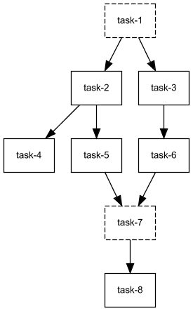

Partial Execution
*****************

Compi is able to run pipelines partially, i.e. not running all tasks, but a subset of them. There are multiple options in the ``compi run``
to do so. By using a simple pipeline example, this section shows how to run pipelines partially.

We will use the :ref:`same pipeline as defined previously<sample_pipeline>`, which has the following graph:

Executing a single pipeline task
--------------------------------

Run the following command to execute a single task of the ``pipeline.xml`` file, specified with the ``--single-task/-st`` parameter:

.. code-block:: bash

 compi run -p pipeline.xml -pa params -st task-8
 
.. note::
  
  With the ``-o`` parameter, the task stdout/stderr are forwarded to the compi stdout/stderr: ``compi run -p pipeline.xml -pa params -st task-8 -o``

Run the pipeline until a specific task
--------------------------------------

It is possible to run a pipeline until a specific task, including all its dependencies.

Run the following command to execute the ``pipeline.xml`` file using the example parameters file (``params``) until task ``task-7``. This command will run ``task-1``, ``task-2``, ``task-3``, ``task-5``, ``task-6`` and ``task-7``.

.. code-block:: bash

 compi run -p pipeline.xml -pa params -ut task-7

Run all the dependencies of a specific task
-------------------------------------------

It is possible to run all the dependencies a specific task.

Run the following command to execute the ``pipeline.xml`` file using the example parameters file (``params``) until task ``task-7``. This command will run ``task-1``, ``task-2``, ``task-3``, ``task-5`` and ``task-6``.

.. code-block:: bash

 compi run -p pipeline.xml -pa params -bt task-7

Start the pipeline execution at a specific task
-----------------------------------------------

It is possible start the pipeline execution at a specific task (e.g. in order to resume the execution after an error or in combination with ``before``, ``until`` and ``single-task`` executions).

Run the following command to execute the ``pipeline.xml`` file using the example parameters file (``params``) starting at task ``task-7``. This command will run all tasks that do not depend on ``task-7``, that is: ``task-7``, ``task-4``, and ``task-8``.

.. code-block:: bash

 compi run -p pipeline.xml -pa params -f task-7

Start the pipeline execution after a specific task
--------------------------------------------------

It is possible start the pipeline execution after a specific task (e.g. in order to resume the execution after an error or in combination with ``before``, ``until`` and ``single-task`` executions). This is similar to the previous example, with the difference that the task specified with ``after`` is not executed.

Run the following command to execute the ``pipeline.xml`` file using the example parameters file (``params``) starting after task ``task-7``. This command will run all tasks that do not depend on ``task-7``, that is: ``task-4`` and ``task-8``.

.. code-block:: bash

 compi run -p pipeline.xml -pa params -a task-7

Running a subpath of tasks
--------------------------

It is possible to specify multiple ``from`` and ``until`` tasks and even specify both of them in the same execution.

Run the following command to execute the ``pipeline.xml`` file using the example parameters file (``params``) starting at task ``task-2`` and until ``task-7``.
This command will start from ``task-2`` and finish on ``task-7``. The path ``task-2`` -> ``task-5`` -> ``task-7`` will be executed.
However, ``task-3`` -> ``task-6`` will be also executed, since they are dependencies of ``task-7``.

.. code-block:: bash

 compi run -p pipeline.xml -pa params -f task-2 -ut task-7

If you want to only run the ``task-2`` -> ``task-5`` -> ``task-7`` path, you have to exclude the ``task-3`` -> ``task-6`` path by also starting after ``task-6``.

.. code-block:: bash

 compi run -p pipeline.xml -pa params -f task-2 -ut task-7 -a task-6

